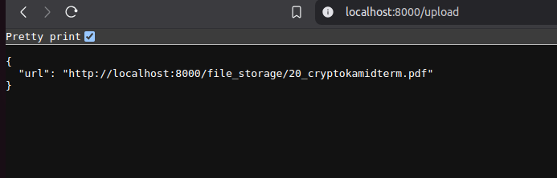
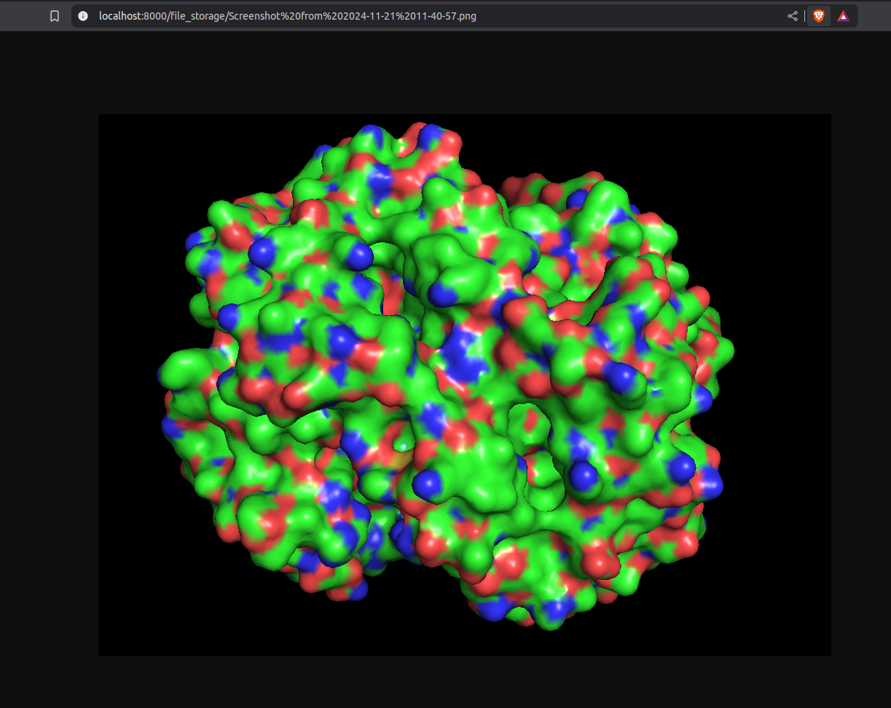

File Storage System in Go

Check it out:- https://go-file-storage.onrender.com

TO RUN LOCALLY - 

Run the API locally by changing the domain in .env file , upload the file using index.html provided 

You will receive the download link , which you can use to download the file from anywhere.

